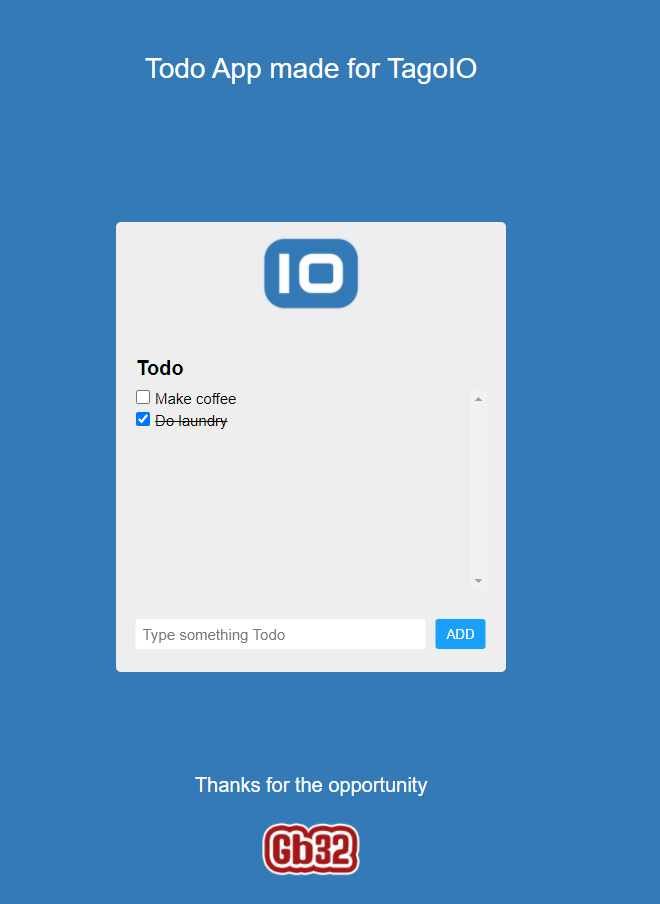

# Getting Started 

## Please consider run the commands below.

### `yarn install`

### `yarn start`

Will run the App in the development mode.
Open [http://localhost:3000](http://localhost:3000) to view it in the browser.

The page will reload if you make edits.\
You will also see any lint errors in the console.

## Check the Figma's mockup out via this link
https://www.figma.com/file/HzvbiblSPVovyXYpuRnUO7/Figma-Basics?node-id=33%3A2

## Preview Image

